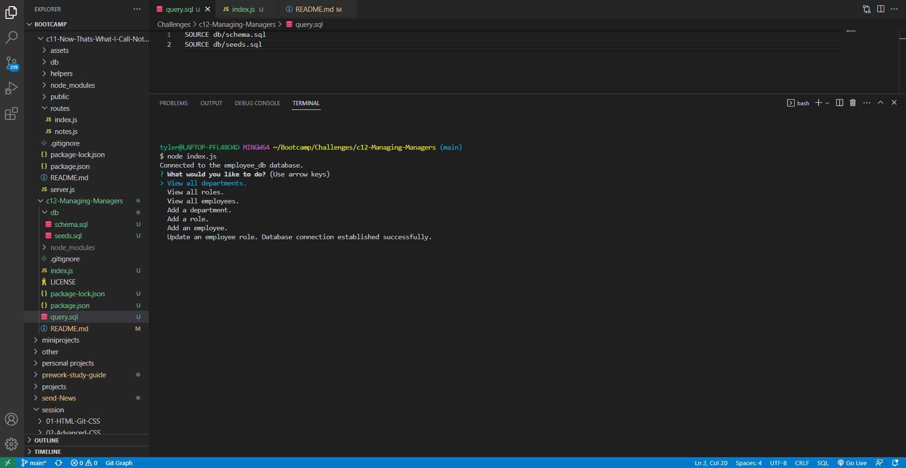
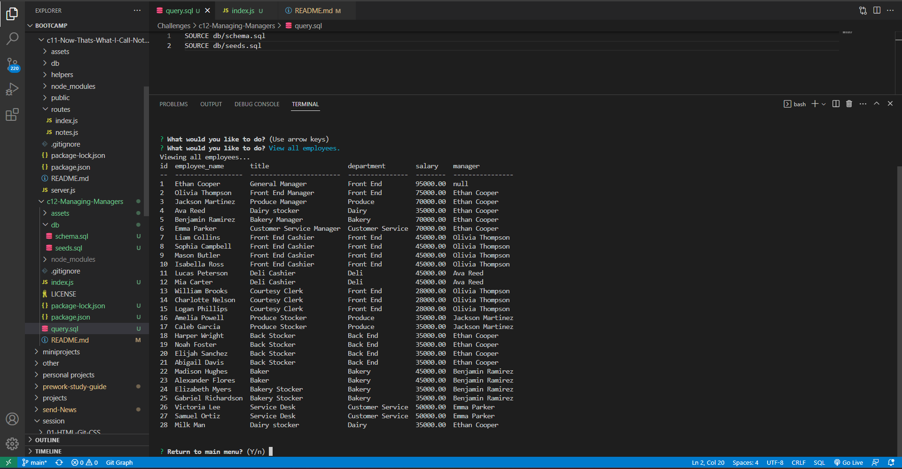

# Managing-Managers

### Upon Loading Application

###  Viewing All Employees

[DEMO](https://www.loom.com/share/9f1102d021f44ba5b132bfe7b0636f6c)

---

## DESCRIPTION

Week 12 Challenger for Full-Stack Programming bootcamp at the University of Washington in partnership with edX. This program runs in node JS and can be used to create, view and update an employee database for a small business. 

---

## INSTALLATION 

This project runs using node and SQL. Follow the necessary installation for these programs. 

After entering the mySQL terminal enter the code "SOURCE query.sql" to create the employee_db and seed it. 

Then, in the normal terminal, run the code "npm i" into node to install the necessary packages.

Finally run the code "node index.js" to begin the application. 

---

## USAGE

To use the application, simply click through the menu to choose an action from "View all departments, View all roles, View all employees, Add a department, Add a role, Add an employee, and Update an employee." If you are viewing a department, role or employee then simply look through the rendered information and decided whether or not you want to continue using the program. If you are adding a department, role or employee, then fill out the necessary information as you are prompted to. If you are trying to update an employee role, then select the employee you are trying to update and fill out the necessary information as you are prompted to. 

---

## CREDITS 

---

## LICENSE 

MIT License 
